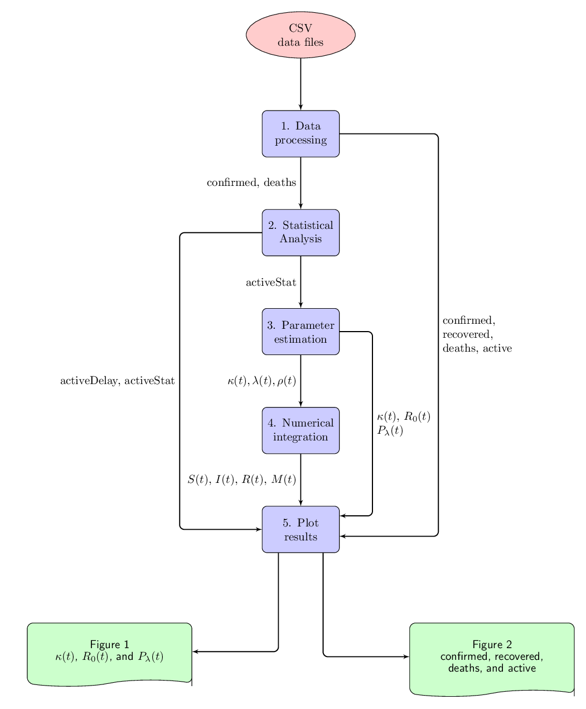

# covid19_parameter_estimation
Python code of the arxiv preprint https://arxiv.org/abs/2011.06515
entitled **"An epidemiological compartmental model with automated parameter
estimation and forecasting of the spread of COVID-19 with analysis of data
from Germany and Brazil"**

The code of this project is distributed in the following files:
* sensibilityAnalysis.py (figure 1)
* activeWorld.py (figures 2, 3, 4, and 5)
* covidBR.py (the remaining figures)

*Flow chart of the data processing in activeWorld.py*

## **How to run the code**

The command line to run activeWorld.py from a Linux terminal is

> **$ python3 activeWorld.py config.txt **

The file config.txt has the following lines in the case of Germany:

country,Germany  
delay,13  
offset,41  
cutoff,0.41  

The command line to run activeWorld.py from a Linux terminal is

> $ python3 activeWorld.py config.txt

The file config.txt has the following lines in the case of Germany:

country,Germany  
delay,13  
offset,41  
cutoff,0.41  

The file config.txt has the following lines in the case of Brazil:

country,Brazil  
delay,14  
offset,22  
cutoff,0.43  

The command line to run covidBR.py from a Linux terminal is

> $ python3 covidBR.py config.txt

In the case of Paraíba, the file config.txt has the following lines:

state,PB  
city,\_  
delay,14  
offset,0  
cutoff,0.38  

The file configCampinaGrandePB.txt has the following lines in the case of Campina Grande:

state,PB  
city,Campina Grande  
delay,14  
offset,21  
cutoff,0.35  

## DATA

All data in the manuscript are contained in the following databases. The data
from Germany and Brazil, was obtained from the site
https://data.humdata.org/dataset/novel-coronavirus-2019-ncov-cases which
contains the data compiled by the Johns Hopkins University Center for Systems
Science and Engineering (JHU CSSE). The specific CSV files for the confirmed,
recovered, and deceased are:

* time_series_covid19_confirmed_global_narrow.csv
* time_series_covid19_deaths_global_narrow.csv
* time_series_covid19_recovered_global_narrow.csv

All these three csv files have to be in the same directory of activeWorld.py
file. The header line of all these three csv files is:

Province/State,Country/Region,Lat,Long,Date,Value,ISO 3166-1 Alpha 3-Codes,
Region Code,Sub-region Code,Intermediate Region Code

The data from Brazilian states and cities are obtained from the url: 

https://data.brasil.io/dataset/covid19/caso.csv.gz

The file *caso.csv* has to be in the same directory as covidBR.py
The header line of *caso.csv* is  
date,state,city,place_type,confirmed,deaths,order_for_place,is_last,
estimated_population_2019,city_ibge_code,confirmed_per_100k_inhabitants,
death_rate
